# Operationalizing Machine Learning

## Table of Content
* [Overview](#overview)
* [Architectural Diagram](#architectural-diagram)
* [Key Steps](#architectural-diagram)
    * [Authentication](#authentication)
    * [Automated ML Experiment](#automated-ml-experiment)
    * [Deploy the best model](#deploy-the-best-model)
    * [Enable logging](#enable-logging)
    * [Swagger Documentation](#swagger-documentation)
    * [Consume model endpoints](#consume-model-endpoints)
    * [Create and publish a pipeline](#create-and-publish-a-pipeline)
* [Screen Recordin](#screen-recording)
* [Standout Suggestions](#standout-suggestions)

## Overview
This project is part of the Udacity Azure ML Nanodegree.
In this project, we use Azure to configure a cloud-based machine learning production model, deploy it, and consume it. We also create, publish, and consume a pipeline.

## Architectural Diagram
These are the steps we followed in this project :

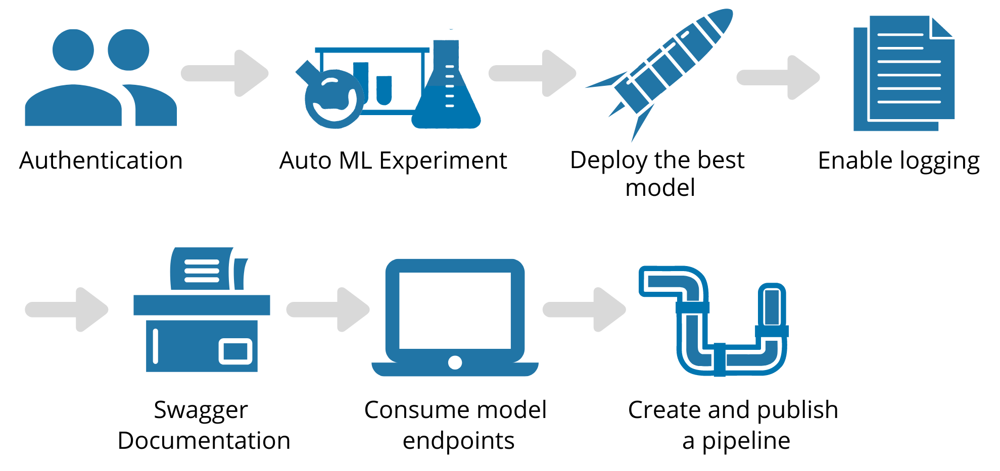

1. **Authentication** : In this step, we need to create a Security Principal (SP) to interact with the Azure Workspace.
2. **Automated ML Experiment** : In this step, we create an experiment using Automated ML, configure a compute cluster, and use that cluster to run the experiment.
3. **Deploy the best model** : Deploying the Best Model will allow us to interact with the HTTP API service and interact with the model by sending data over POST requests.
4. **Enable logging** : Logging helps monitor our deployed model. It helps us know the number of requests it gets, the time each request takes, etc.
5. **Swagger Documentation** : In this step, we consume the deployed model using Swagger.
6. **Consume model endpoints** : We interact with the endpoint using some test data to get inference.
7. **Create and publish a pipeline** : In this step, we automate this workflow by creating a pipeline with the Python SDK.

## Key Steps

### Authentication
I used the lab Udacity provided to us, so I skipped this step since I'm not authorized to create a security principal.

### Automated ML Experiment
In this step, I created an AutoML experiment to run using the [Bank Marketing](https://automlsamplenotebookdata.blob.core.windows.net/automl-sample-notebook-data/bankmarketing_train.csv) Dataset which was loaded in the Azure Workspace, choosing **'y'** as the target column.

*Figure 1: Bank Marketing Dataset*
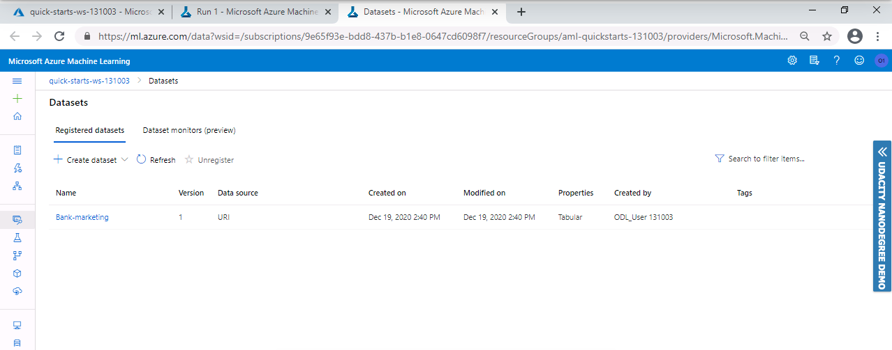
I uploaded this dataset into Azure ML Studio in the *Registered Dataset* Section using the url provided in the project.

For the compute cluster, I used the **Standard_DS12_v2** for the Virtual Machine and 1 as the **minimum number of nodes**.

I ran the experiment using classification, without enabling Deep Learning. The run took some time to test various models and found the best model for the task.

*Figure 2-3-4-5: Create an AutoML experiment*
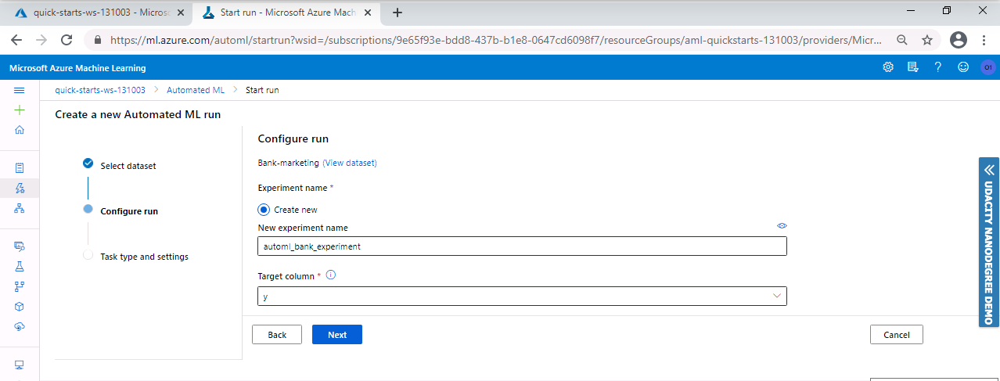
After selecting the dataset which I'll work with, I chose an experiment name and the targey column for the training.

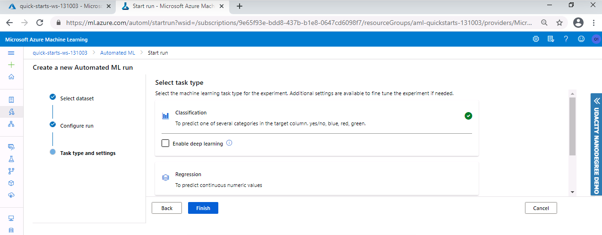
Since it's a classification problem, I specified the task type without enabling deep learning.

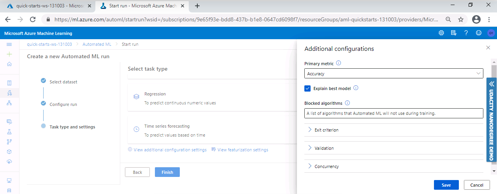
I checked *Explain best model* to have insights on the best model, and chose *Accuracy* as the primary metric the trained models will be compared by.

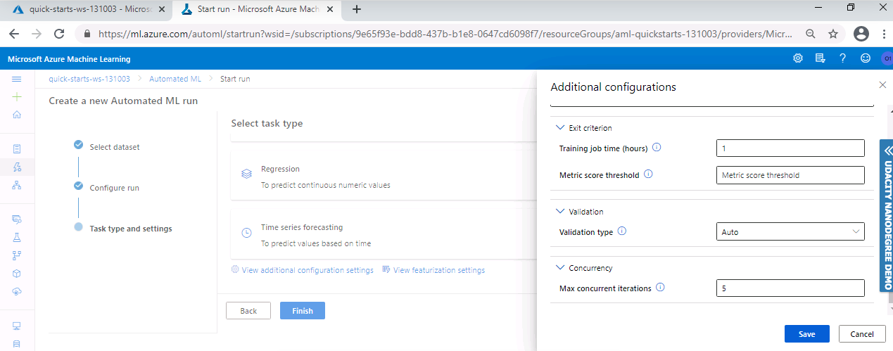
I reduced the *Exit Criterion* to 1 hour and *Concurrency* to 5 concurrent iterations max.

*Figure 6: AutoML run*
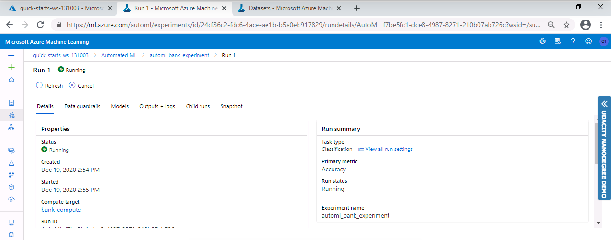
The experiment is running, and many models are being trained on the **Bank Marketing** Dataset to find the best one.

*Figure 7: AutoML run Complete*
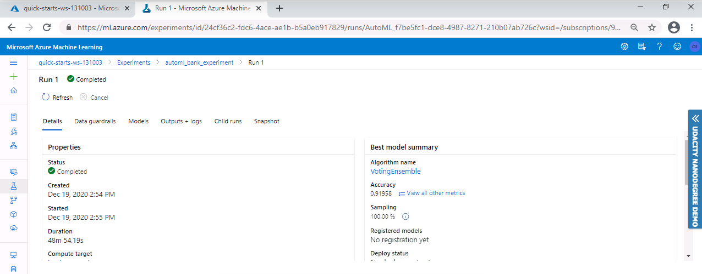
After a while, the eperiment is complete and I can access the models that were trained and find the best model.

The best model for this classification problem was a **Voting Ensemble** model with **0.91958** Accuracy.

*Figure 8: Best model*
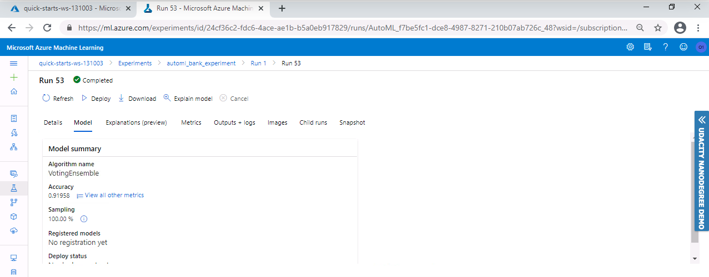
I access the best model to learn more about its metrics and other details.

*Figure 9-10-11: Best model metrics*
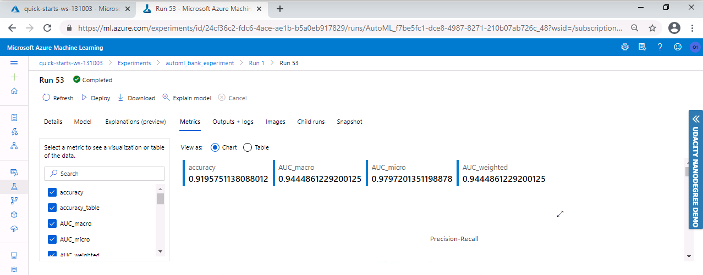
In this section, I can see all of the model's metrics, such as *Accuracy*.

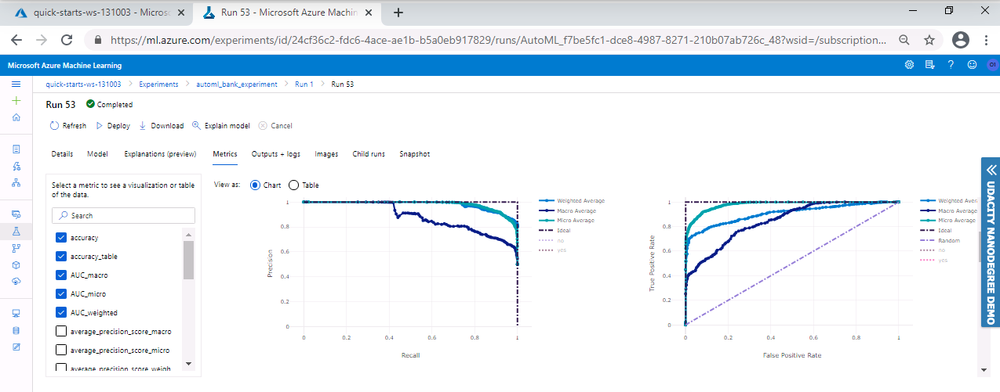
I can see some graphs such as *Recall* and *False Positive Rate*.

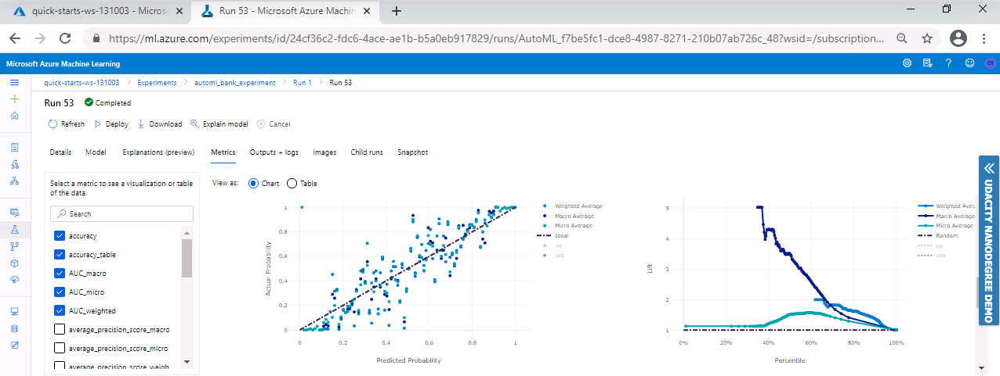
There are many other details that I can access on the side by checking any value I'm interested in.

### Deploy the best model
To interact with the best chosen model for our task, we need to deploy it. This can be easily done in the Azure Machine Learning Studio, which provides us with an URL to send our test data to.

In this step, we deployed our trained Voting Ensemble model using Azure Container Instance (ACI), with authentication enabled.

*Figure 12-13: Deploy the best model*
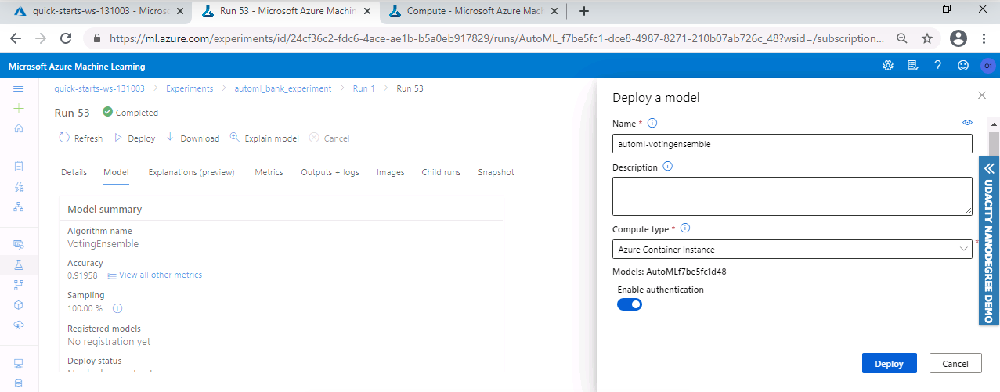
I deployed the best model using *Azure Container Instance* (ACI) with *Authentication* enabled.

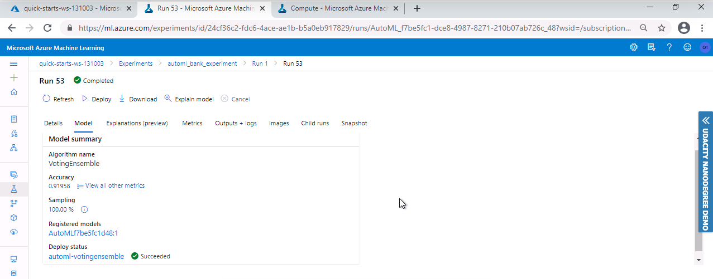
The model is successfully deployed, and we can access the model endpoint in the *Endpoints* section of Azure ML Studio.

*Figure 14: Endpoint*
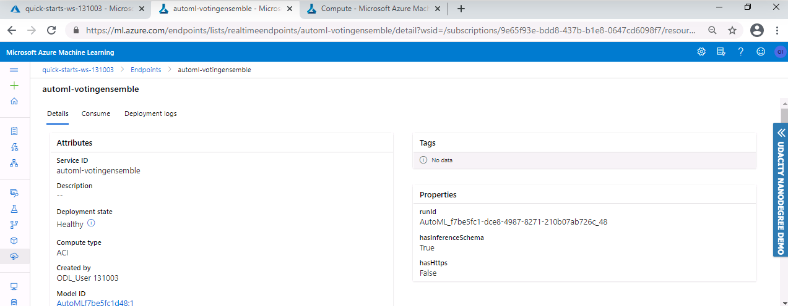
In this section, we can see details about the model endpoint as well as information on how to consume it.

### Enable logging
Enabling Application Insights and Logs could have been done at the time of deployment, but for this project we achieved it using Azure Python SDK.

*Figure 15-16-17: Execute logs.py*
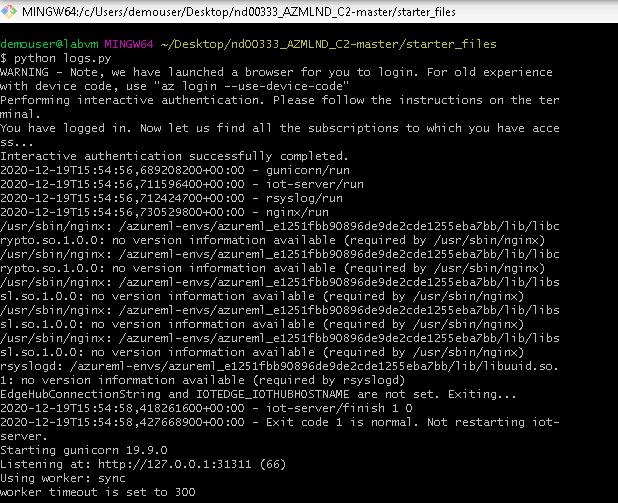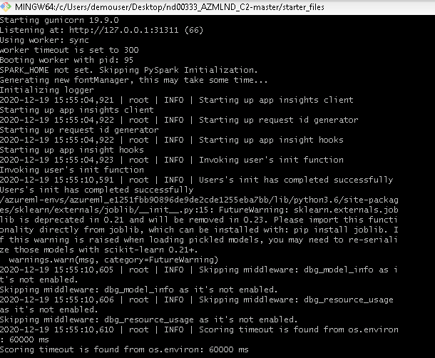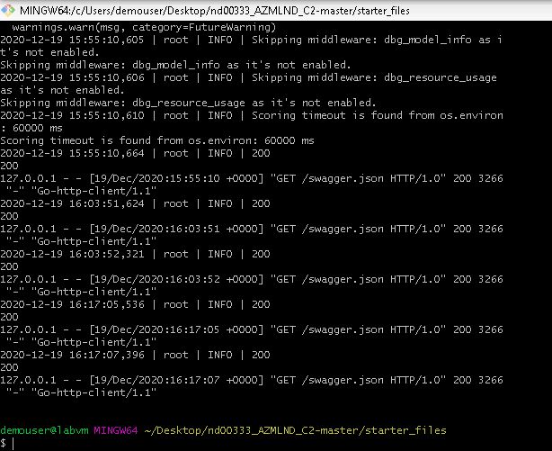
Running the logs.py script requires interactive authentication, after successfully logging in, we can see the logs in the screenshots above.

*Figure 18: Application Insight*
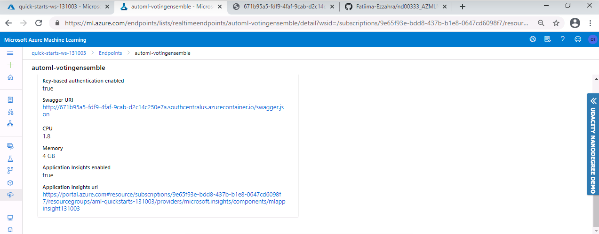
By running the logs.py script, we enable *Application Insight*.

### Swagger Documentation
To consume our best AutoML model using Swagger, we first need to download the **swagger.json** file provided to us in the Endpoints section of Azure Machine Learning Studio.

Then we run the **swagger.sh** and **serve.py** files to be able to interact with the swagger instance running with the documentation for the HTTP API of the model.

*Figure 19: Default Swagger page*
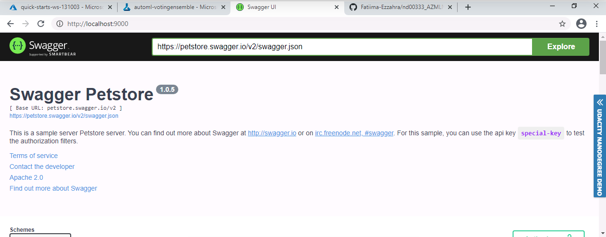
This is the default *Swagger* documentation before running the swagger.sh script.

*Figure 20-21-22: Swagger documentation for the HTTP API of the model*
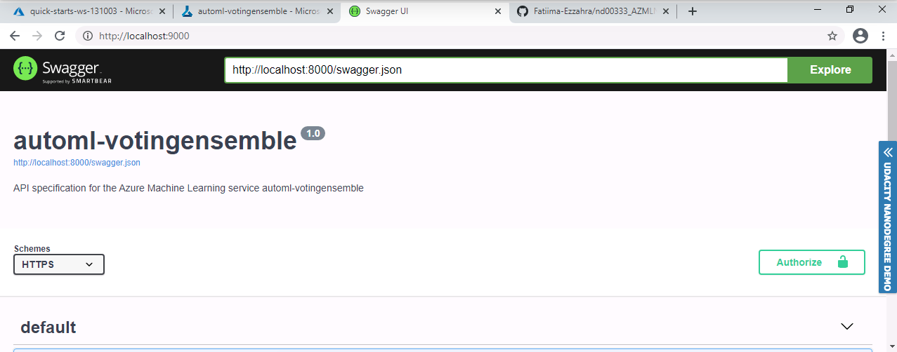
After running the script, we can find our best model's documentation instead of the default Swagger page.

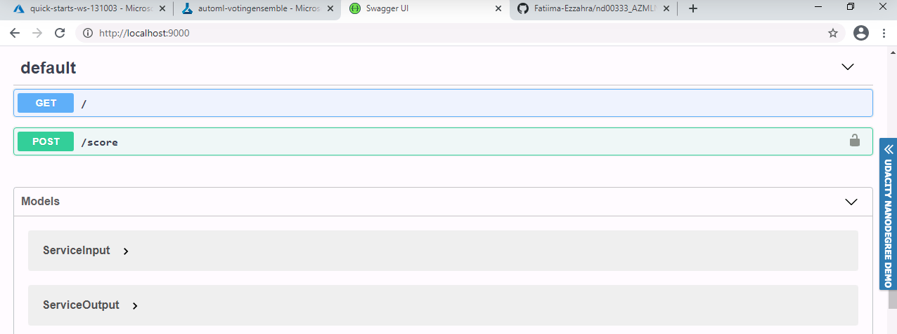
This is the content of the API, diplaying the methods used to interact with the model.

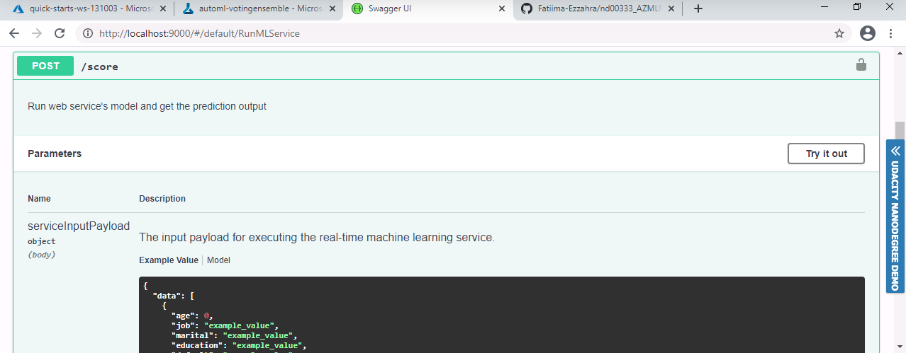
And this is the input for the **/score** POST method that returns our deployed model's preditions.

### Consume model endpoints
Finally, it's time to interact with the model and feed some test data to it. We do this by providing the **scoring_uri** and the **key** to the **endpoint.py** script and running it.

*Figure 23: Consume the endpoint*
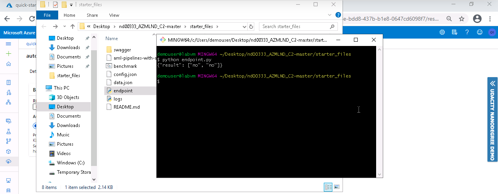
After modifying both the scoring_uri and the key to match the key for my service and the URI that was generated after deployment, I ran the endpoint.py script to get inference from the deployed model.

#### (Optional) Benchmark
To do this, we make sure **Apache Benchmark** is installed and available. After executing the **endpoint.py** script, we run the **benchmark.sh** scripe to load-test our deployed model.

*Figure 24-25-26: Benchmark*
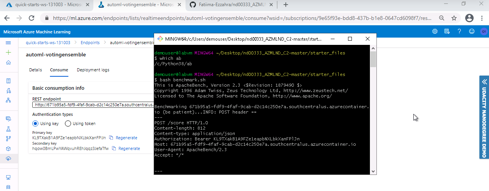
Checking if *Apache Benchmark* is available and running the benchmark.sh script.

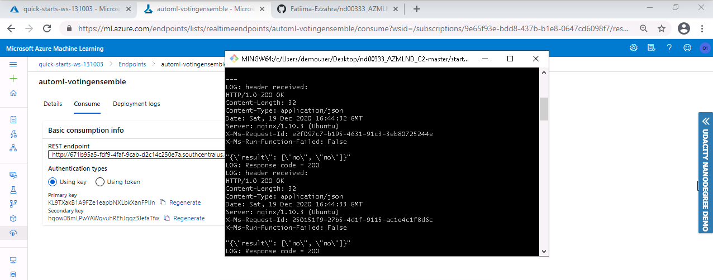
Results of load-testing our deployed model.

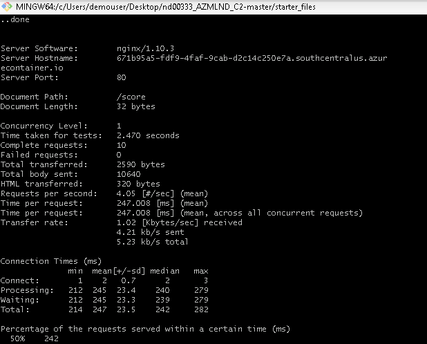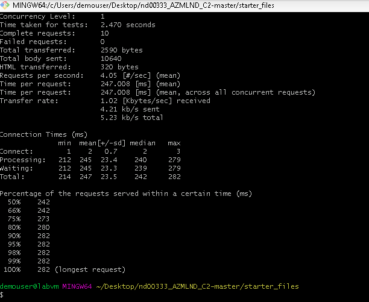
This gives us insights on things like: Requests per second, Average time per request, Number of failed requests, etc.

### Create and publish a pipeline
For this step, I used the **aml-pipelines-with-automated-machine-learning-step** Jupyter Notebook to create a **Pipeline**

I created, consumed and published the best model for the bank marketing dataset using AutoML with Python SDK.

*Figure 27: Create a Pipeline in the SDK*
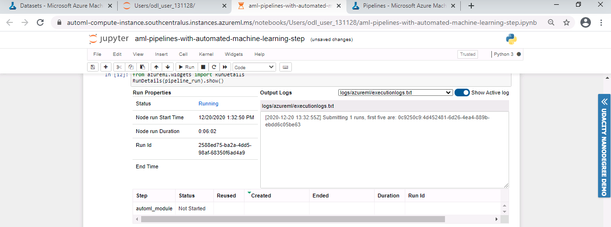
After updating the notebook to have the same keys, URI, dataset, cluster, and model names already created, I run through the cells to create a pipeline.

*Figure 28: Pipeline in Azure Studio*
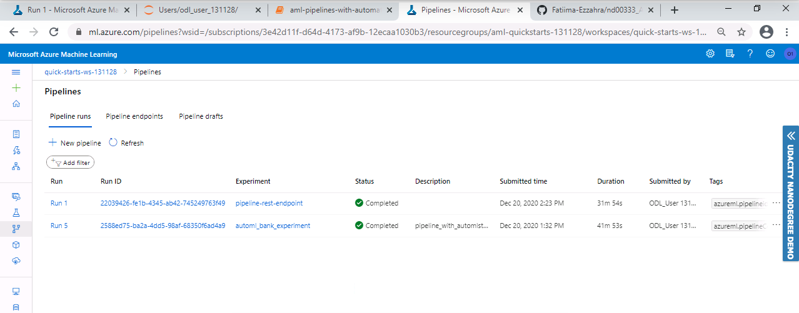
This is the pipeline created in the *Pipelines* section of Azure ML Studio.

*Figure 29: Pipeline Overview in Azure Studio*
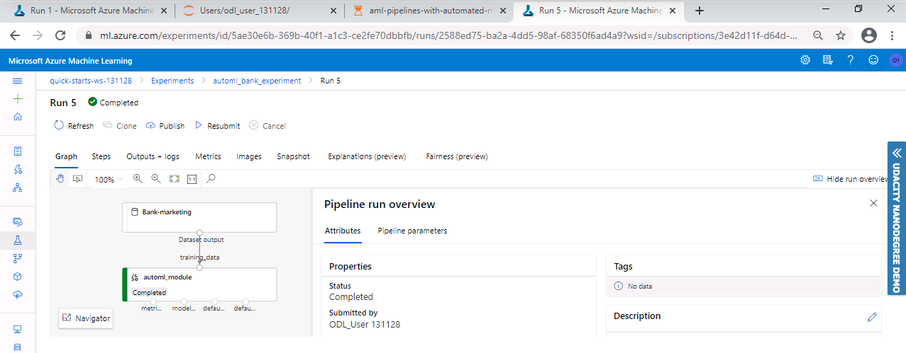
This is the Pipeline Overview in the Azure ML Studio.

*Figure 30-31-32: Create the REST endpoint*
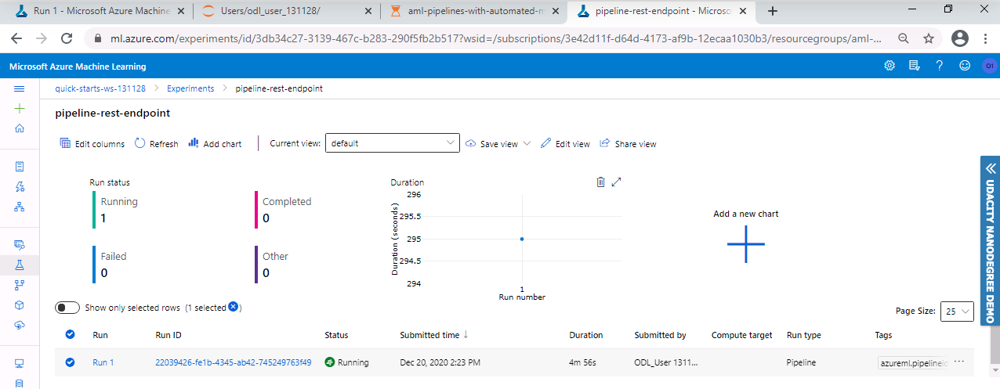

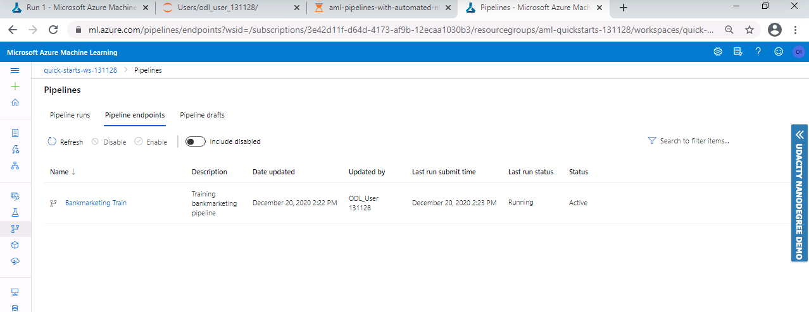

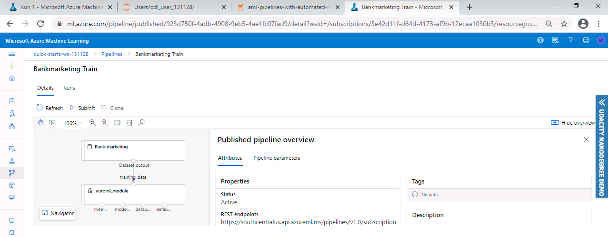
This is the REST endpoint in Azure ML Studio, with a status of ACTIVE.

## Screen Recording
[Youtube Link](https://www.youtube.com/embed/xXjspFEyZnY)
<!--[Subtitles](https://drive.google.com/file/d/1urtaKvpkmQr-1t5N8SGM42FD4NZKKts_/view?usp=sharing)-->

## Standout Suggestions
One thing that stood out to me when creating an AutoML run was the imbalanced data issue. This can lead to biased prediction, which can affect negatively the model's accuracy. Another suggestion is enabling Deep Learning. This will take more time to run, but can improve the results by training and testing more models .

*Figure 33-34: Imbalanced Data*
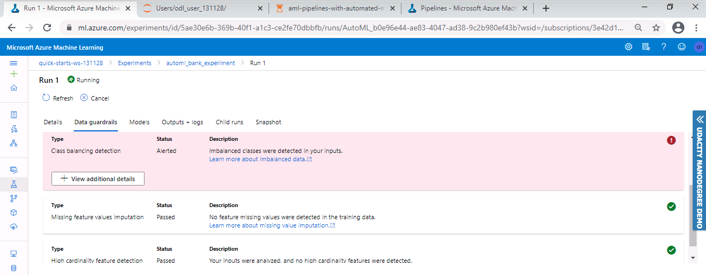

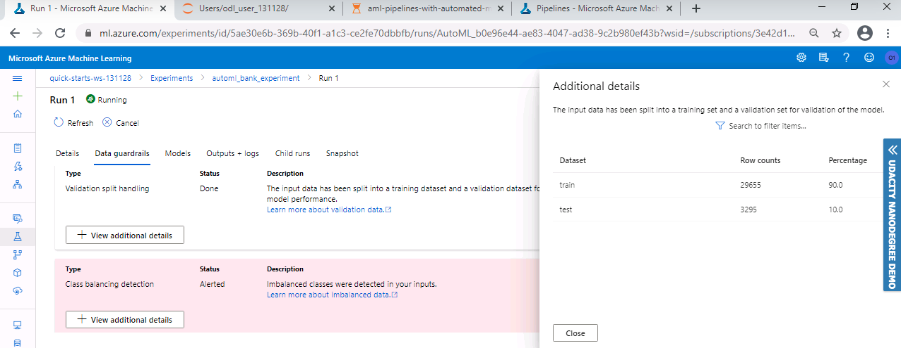
We can see in the Studio that there's an issue with the data we're using.
