# Operationalizing Machine Learning

## Table of Content
* [Overview](#overview)
* [Architectural Diagram](#architectural-diagram)
* [Key Steps](#architectural-diagram)
    * [Authentication](#authentication)
    * [Automated ML Experiment](#automated-ml-experiment)
    * [Deploy the best model](#deploy-the-best-model)
    * [Enable logging](#enable-logging)
    * [Swagger Documentation](#swagger-documentation)
    * [Consume model endpoints](#consume-model-endpoints)
    * [Create and publish a pipeline](#create-and-publish-a-pipeline)
* [Screen Recordin](#screen-recording)
* [Standout Suggestions](#standout-suggestions)

## Overview
This project is part of the Udacity Azure ML Nanodegree.
In this project, we use Azure to configure a cloud-based machine learning production model, deploy it, and consume it. We also create, publish, and consume a pipeline.

## Architectural Diagram
These are the steps we followed in this project :

1. **Authentication** : In this step, we need to create a Security Principal (SP) to interact with the Azure Workspace.
2. **Automated ML Experiment** : In this step, we create an experiment using Automated ML, configure a compute cluster, and use that cluster to run the experiment.
3. **Deploy the best model** : Deploying the Best Model will allow us to interact with the HTTP API service and interact with the model by sending data over POST requests.
4. **Enable logging** : Logging helps monitore our deployed model. It helps us know the number of requests it gets, the time each request takes, etc.
5. **Swagger Documentation** : In this step, we consume the deployed model using Swagger.
6. **Consume model endpoints** : We interact with the endpoint using some test data to get inference.
7. **Create and publish a pipeline**

## Key Steps

### Authentication
I used the lab Udacity providedto us, so I skipped this step since I'm not authorized to create a security principal.

### Automated ML Experiment
In this step, I created an AutoML experiment to run using the [Bank Marketing](https://automlsamplenotebookdata.blob.core.windows.net/automl-sample-notebook-data/bankmarketing_train.csv) Dataset which was loaded in the Azure Workspace, choosing **'y'** as the target column.

*Figure 1: Bank Marketing Dataset*
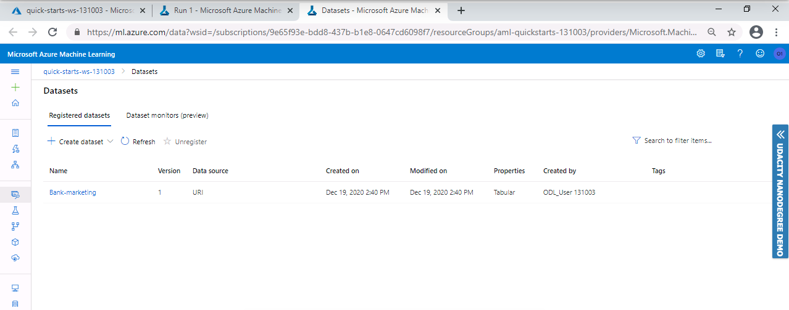

For the compute cluster, I used the **Standard_DS12_v2** for the Virtual Machine and 1 as the **minimum number of nodes**.

I ran the experiment using classification, without enabling Deep Learning. The run took some time to test various models and found the best model for the task.

*Figure 2-3-4-5: Create an AutoML experiment*
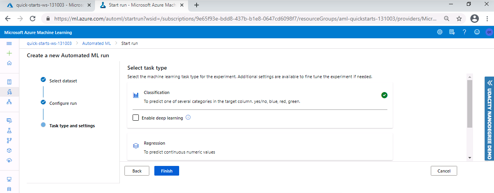

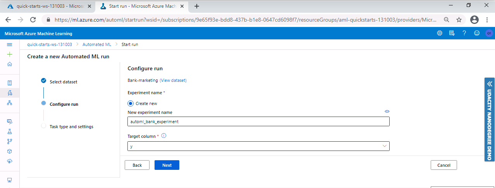

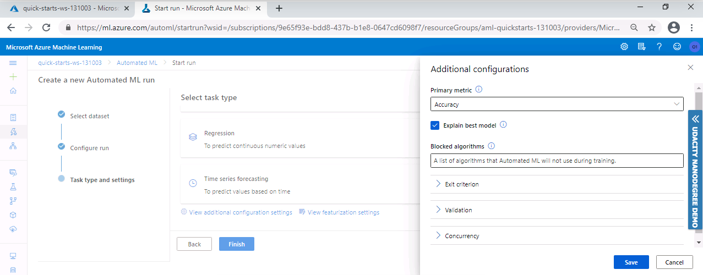

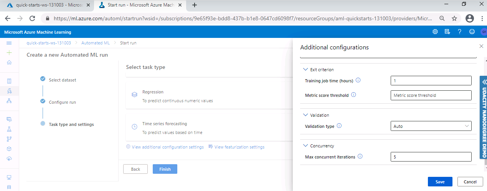

*Figure 6: AutoML run Running*
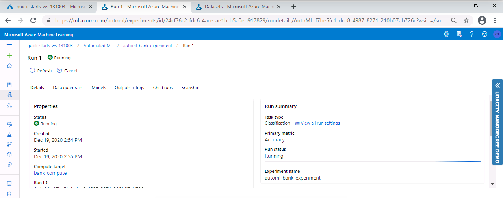

*Figure 7: AutoML run Complete*
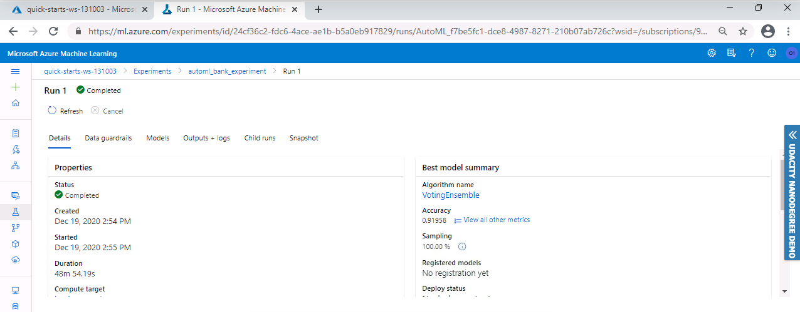

The best model for this classification problem was a **Voting Ensemble** model with **0.91958** Accuracy.

*Figure 8: Best model*
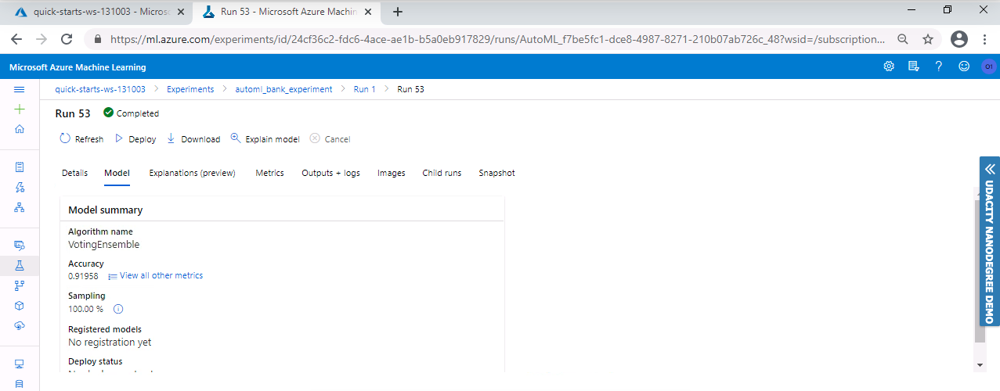

*Figure 9-10-11: Best model metrics*
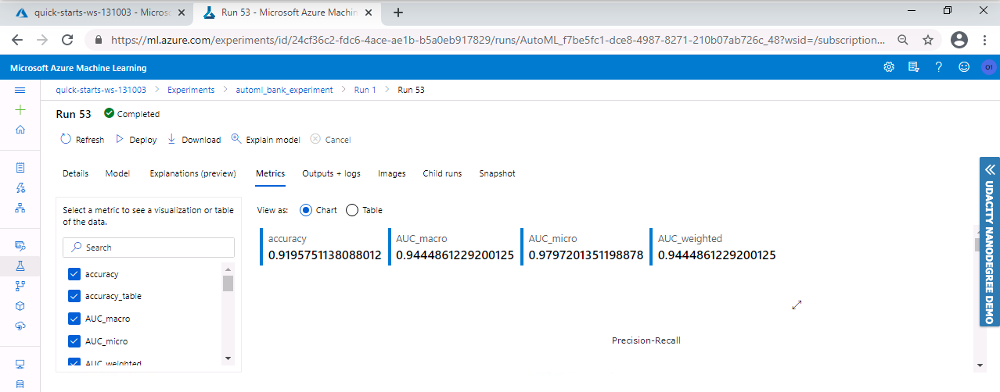
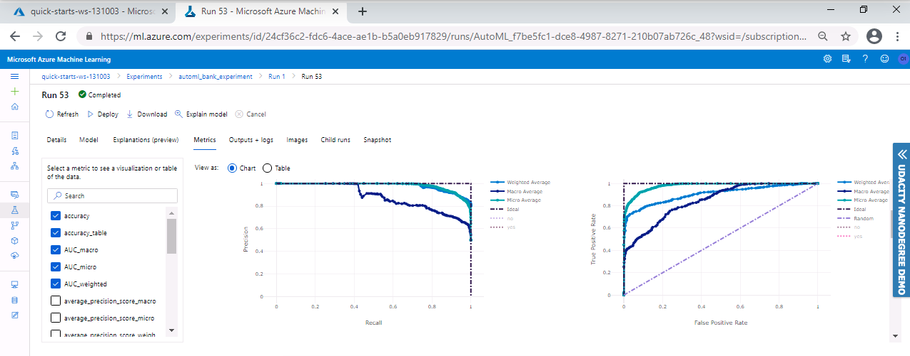
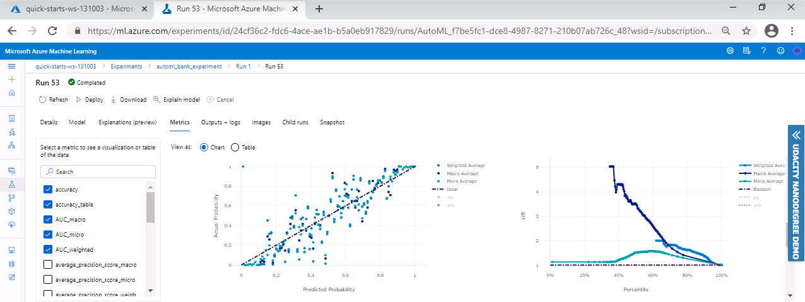

### Deploy the best model
To interact with the best chosen model for our task, we need to deploy it. This can be easily done in the Azure Machine Learning Studio, which provides us with an URL to send our test data to.

In this step, we deployed our trained Voting Ensemble model using Azure Container Instance (ACI), with authentication enabled.

*Figure 12-13-14: Deploy the best model*
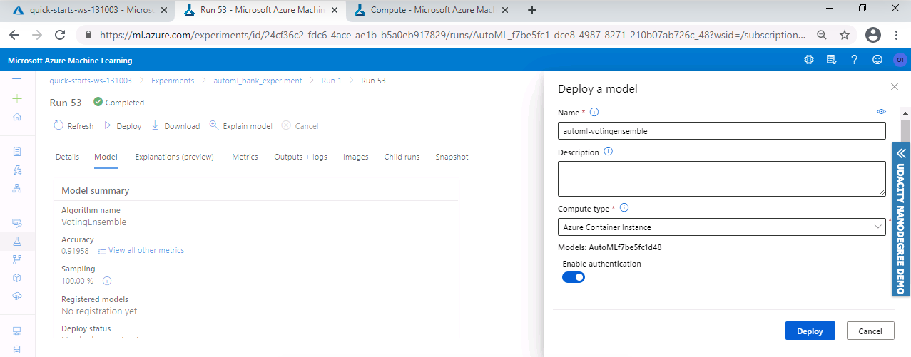

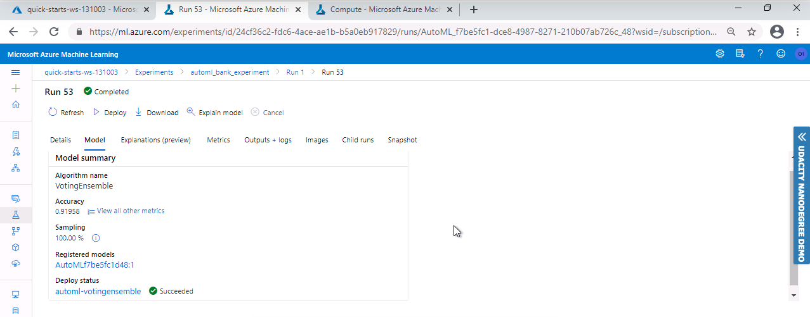

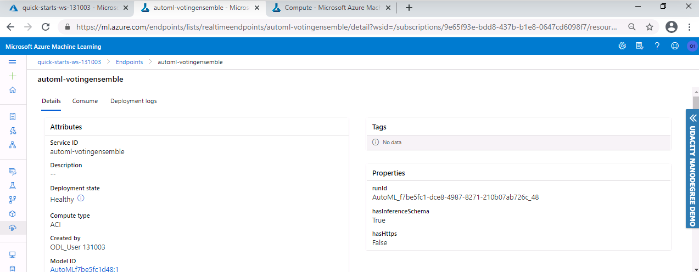

### Enable logging
Enabling Application Insights and Logs could have been done at the time of deployment, but for this project we achieved it using Azure Python SDK.

*Figure 15-16-17: Execute logs.py*
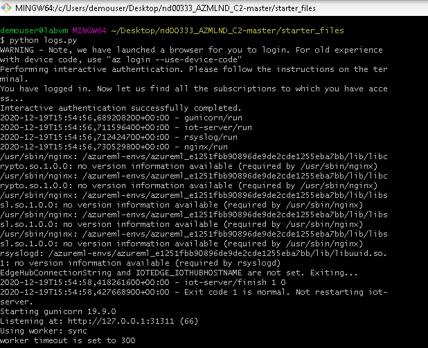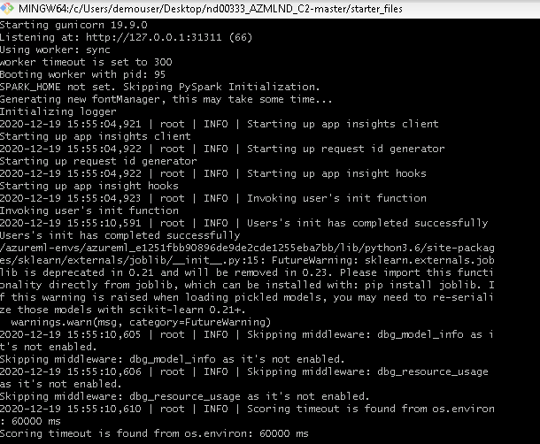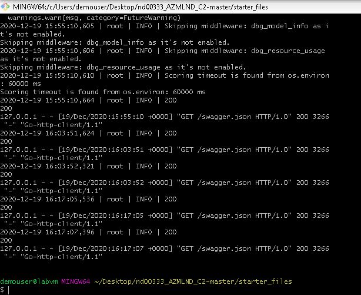

*Figure 18: Application Insight*
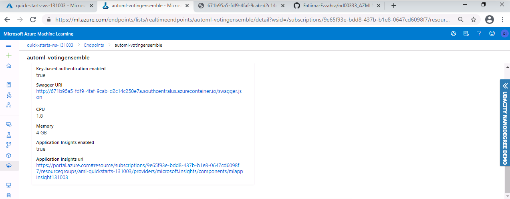

### Swagger Documentation
To consume out best AutoML model using Swagger, we first need to download the **swagger.json** file provided to us in the Endpoints section of Azure Machine Learning Studio.

Then we run the **swagger.sh** and **serve.py** files to be able to interact with the swagger instance running with the documentation for the HTTP API of the model.

*Figure 19: Default Swagger page*
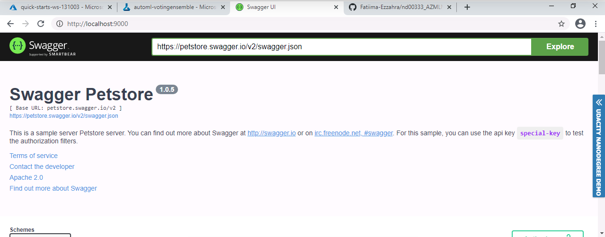

*Figure 20-21-22: Swagger documentation for the HTTP API of the model*
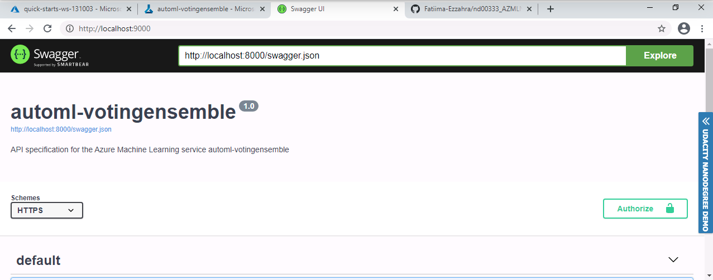

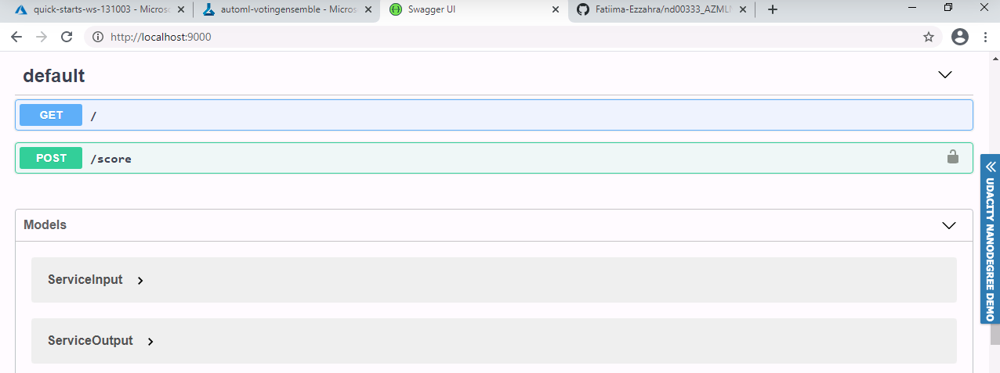

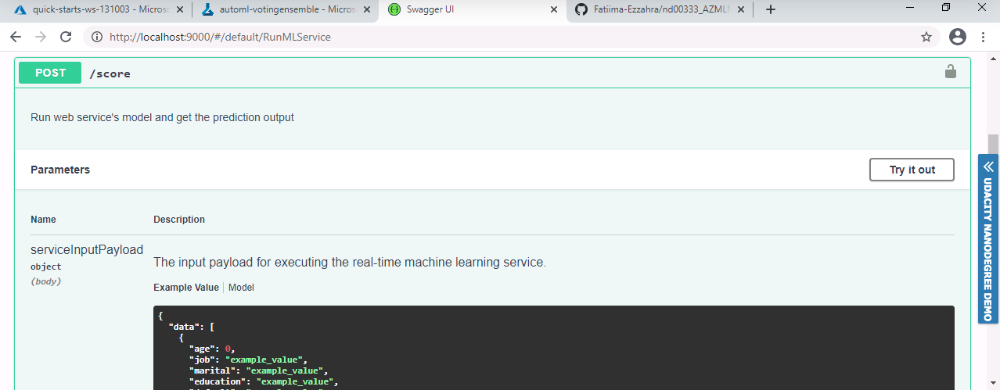

### Consume model endpoints
Finally, it's time to interact with the model and feed some test data to it. We do this by providing the **scoring_uri** and the **key** to the **endpoint.py** script and running it.

*Figure 23: Consume the endpoint*
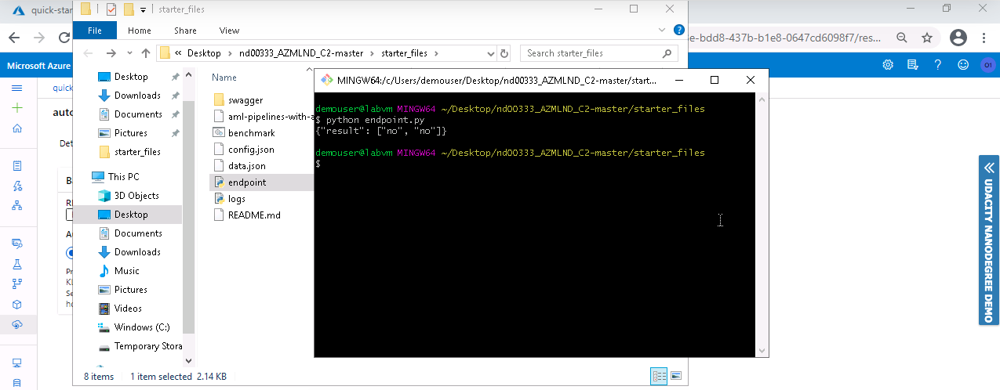

#### (Optional) Benchmark
To do this, we make sure **Apache Benchmark** is installed and available. After executing the **endpoint.py** script, we run the **benchmark.sh** scripe to load-test our deployed model.

*Figure 24-25-26: Benchmark*
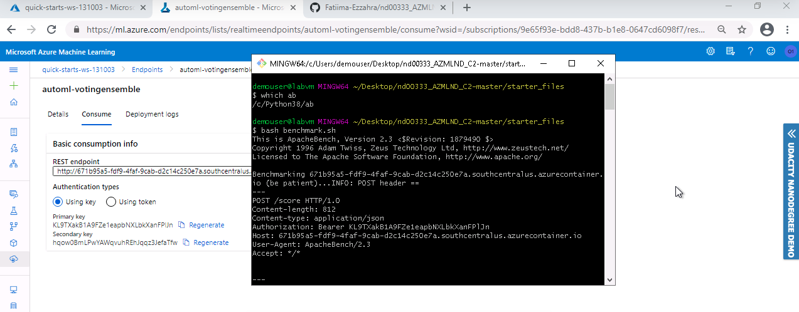
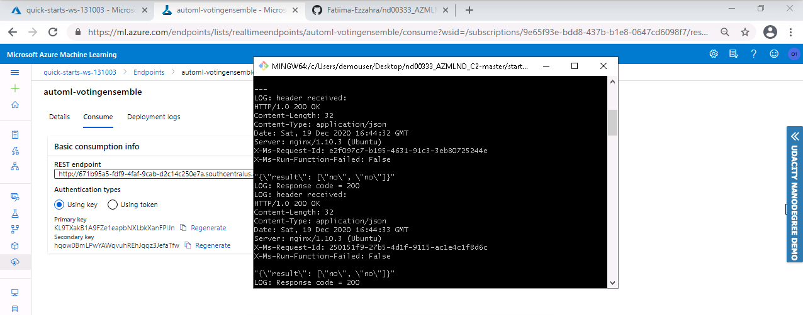
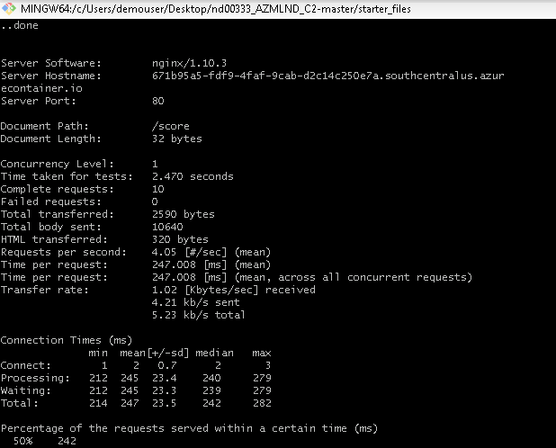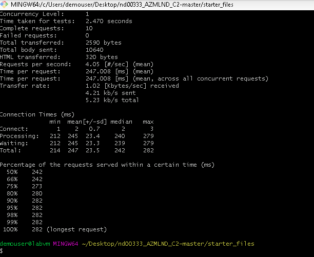

### Create and publish a pipeline
For this step, I used the **aml-pipelines-with-automated-machine-learning-step** Jupyter Notebook to create a **Pipeline**

I created, consumed and published the best model for the bank marketing dataset using AutoML with Python SDK.

*TODO* Remeber to provide screenshots of the `RunDetails` widget as well as a screenshot of the best model trained with it's parameters.

## Screen Recording
*TODO* Provide a link to a screen recording of the project in action. Remember that the screencast should demonstrate:

## Standout Suggestions
*TODO (Optional):* This is where you can provide information about any standout suggestions that you have attempted.
